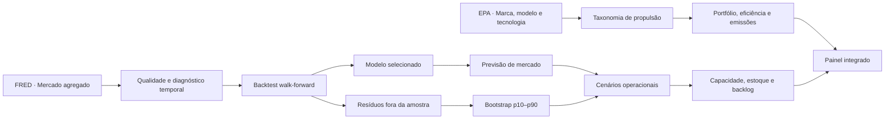

# Arquitetura e Metodologia — Quant Automotive Intelligence

## Visão da plataforma

A **Quant Automotive Intelligence** integra duas perspectivas complementares da indústria automotiva dos Estados Unidos. A primeira é a leitura de **mercado agregado**, baseada na série mensal `TOTALSA` do FRED. A segunda é a leitura de **produto e tecnologia**, baseada no catálogo público da U.S. Environmental Protection Agency (EPA), que contém configurações de veículos por fabricante, modelo, ano-modelo, segmento, combustível, eficiência, emissões, autonomia e custo anual estimado [1] [2].

> A plataforma distingue explicitamente os domínios de evidência. A série FRED mede o mercado agregado e não atribui vendas a fabricantes. A base EPA descreve atributos técnicos de configurações de veículos e não mede participação de vendas, rentabilidade ou qualidade de produto. As duas fontes podem ser analisadas juntas para enriquecer o contexto, mas não devem ser usadas para inferir vendas por marca.

## Arquitetura funcional

| Camada | Fonte e componentes | Questão que responde |
|---|---|---|
| Mercado | FRED `TOTALSA`, qualidade de dados, STL, ADF, ACF/PACF | Qual é a dinâmica agregada de demanda de veículos leves? |
| Forecasting | Sazonal ingênuo, Holt-Winters, Ridge com defasagens e walk-forward | Qual modelo tem melhor desempenho fora da amostra? |
| Incerteza | Bootstrap dos resíduos do backtest | Qual é a faixa empírica de demanda futura? |
| Produto | EPA: fabricante, modelo, classe EPA, ano-modelo e configuração | Como está estruturado o universo de produto filtrado? |
| Tecnologia | Propulsão, MPG/MPGe, CO₂ de escapamento, autonomia e custo anual | Como eficiência e tecnologias se distribuem entre portfólios? |
| Cenário operacional | Programação linear com capacidade, estoque e backlog parametrizados | Como capacidade e nível de serviço respondem a cenários de mercado? |
| Interface | Streamlit e Plotly | Como navegar de evidências para decisões e comparações? |

## Fluxo analítico

## Base de mercado: FRED `TOTALSA`

A série `TOTALSA` é disponibilizada pelo Federal Reserve Economic Data e tem origem no Bureau of Economic Analysis. Ela representa vendas totais de veículos em milhões de unidades a uma taxa anual ajustada sazonalmente (SAAR) [1]. A plataforma preserva a unidade oficial na modelagem. A conversão por 12 aparece somente para expressar cenários operacionais mensais em veículos.

A qualidade do dado inclui verificação de duplicidades, valores ausentes, continuidade mensal e pontos fora da faixa interquartil. Outliers não são removidos automaticamente, pois valores extremos em série macroeconômica podem registrar mudanças reais de demanda ou oferta.

O diagnóstico combina teste Dickey-Fuller aumentado, decomposição STL e ACF/PACF. A STL separa a série em observado, tendência, sazonalidade e resíduo, seguindo Cleveland et al. [4].

## Seleção temporal, forecast e incerteza

A plataforma compara três modelos: referência sazonal por mês, Holt-Winters aditivo e Ridge com defasagens de 1 e 12 meses, tendência e dummies mensais. Todos são avaliados por validação cruzada temporal **walk-forward** com janela expansiva. Cada dobra treina apenas com observações anteriores ao período testado, preservando a direção do tempo e evitando vazamento de informação.

MAE, RMSE e MAPE são reportados por dobra. O modelo com menor MAPE médio é selecionado para o horizonte configurado. Em seguida, o diagnóstico de resíduos usa distribuição e ACF dos erros fora da amostra, além do teste de Ljung-Box [5].

A incerteza é obtida por *bootstrap* empírico: resíduos observados no backtest são reamostrados com reposição e somados à previsão pontual. Os percentis 10 e 90 formam a faixa inferior e superior, sem pressupor normalidade dos erros [6].

## Base de produto e tecnologia: U.S. EPA

A EPA disponibiliza dados de economia de combustível para veículos leves por ano-modelo, em arquivo CSV atualizado periodicamente. A página de download informa cobertura a partir de 1984 e atualização da base para os anos-modelo mais recentes [2]. A EPA e o Department of Energy mantêm a base a partir de testes de veículos e informações de fabricantes sob supervisão da agência [2].

| Campo EPA | Uso na plataforma |
|---|---|
| `make`, `model`, `baseModel` | Identificação de fabricante e modelo. |
| `year`, `VClass` | Recorte temporal e segmentação de produto. |
| `fuelType1`, `atvType` | Classificação de propulsão. |
| `city08`, `highway08`, `comb08` | Eficiência publicada em MPG/MPGe. |
| `co2TailpipeGpm` | Emissões de escapamento em gramas por milha. |
| `range`, `rangeCity`, `rangeHwy` | Autonomia publicada para configurações aplicáveis. |
| `fuelCost08`, `youSaveSpend` | Custo anual de energia e comparação publicada. |
| `cylinders`, `displ`, `trany`, `drive` | Características mecânicas e de transmissão. |

A plataforma constrói uma taxonomia legível de propulsão: combustão, diesel, flex/etanol, gás natural, híbrido, híbrido plug-in, elétrico a bateria e célula a combustível. Essa classificação permite observar a composição tecnológica do universo filtrado e sua evolução por ano-modelo.

Os nomes de marca aparecem literalmente como publicados no campo `make`. Como o arquivo cobre décadas de ano-modelo, inclui fabricantes atuais e nomes históricos. A plataforma não normaliza conglomerados nem deduz atividade comercial: a auditoria de marcas informa somente primeiro ano, último ano e presença temporal no próprio snapshot. O relatório reprodutível está em [`docs/AUDITORIA_CATALOGO_EPA.md`](AUDITORIA_CATALOGO_EPA.md).

## Métricas de portfólio

As métricas são calculadas sobre **configurações registradas na EPA**, não sobre unidades vendidas. Por isso, “configurações” mede diversidade de registros de produto, enquanto “modelos” mede a quantidade de combinações únicas de fabricante e modelo presentes no filtro.

| Métrica | Definição | Interpretação correta |
|---|---|---|
| Configurações | Número de registros EPA no recorte | Amplitude técnica observável, não volume comercial. |
| Modelos | Combinações únicas de fabricante e modelo | Diversidade de oferta no catálogo. |
| MPG/MPGe médio | Média de `comb08` válida | Eficiência publicada para as configurações filtradas. |
| CO₂ médio | Média de `co2TailpipeGpm` válida | Emissões de escapamento; veículos elétricos podem não ter valor comparável. |
| Mix eletrificado | Proporção de configurações elétricas ou híbridas | Composição tecnológica do catálogo, não participação de mercado. |
| Presença temporal da marca | Último ano-modelo observado no campo `make` | Cobertura do snapshot EPA; não infere marca ativa, propriedade ou venda. |
| Autonomia máxima | Maior `range` publicado | Atributo de configuração, não desempenho real em todas as condições. |

## Cenário operacional

A camada de planejamento traduz a previsão de mercado em uma demanda de referência usando uma participação de mercado parametrizada. A programação linear define produção \(P_t\), estoque \(I_t\) e demanda pendente \(B_t\):

\[
D_t = \operatorname{round}\left(\frac{SAAR_t}{12} \times 1.000.000 \times s\right)
\]

\[
\min \sum_t c_p P_t + c_i I_t + c_b B_t
\]

sujeita a:

\[
I_t - B_t = I_{t-1} - B_{t-1} + P_t - D_t
\]

\[
0 \le P_t \le \text{Capacidade}; \quad I_t, B_t \ge 0
\]

Essa formulação fornece uma estrutura transparente para discutir trade-offs entre capacidade, estoque, atendimento e ruptura. Seus parâmetros devem ser configurados com dados operacionais quando disponíveis; a plataforma não afirma que os valores padrão retratam uma empresa específica.

## Atualização e reprodutibilidade

O repositório mantém *snapshots* locais das duas bases para permitir execução reprodutível. A aplicação consulta o FRED quando disponível e utiliza o snapshot local em caso de indisponibilidade. O snapshot EPA é lido localmente, e sua fonte oficial está documentada em `data/SOURCES.md`.

## Referências

[1]: https://fred.stlouisfed.org/series/TOTALSA "FRED — Total Vehicle Sales (TOTALSA)"
[2]: https://www.fueleconomy.gov/feg/download.shtml "U.S. EPA / FuelEconomy.gov — Download Fuel Economy Data"
[3]: https://www.epa.gov/greenvehicles/50-years-epas-automotive-trends-report "U.S. EPA — 50 Years of Automotive Trends Report"
[4]: https://www.wessa.net/download/stl.pdf "Cleveland et al. (1990) — STL: A Seasonal-Trend Decomposition Procedure Based on Loess"
[5]: https://doi.org/10.1093/biomet/65.2.297 "Ljung & Box (1978) — On a Measure of Lack of Fit in Time Series Models"
[6]: https://doi.org/10.1214/aos/1176344552 "Efron (1979) — Bootstrap Methods: Another Look at the Jackknife"
